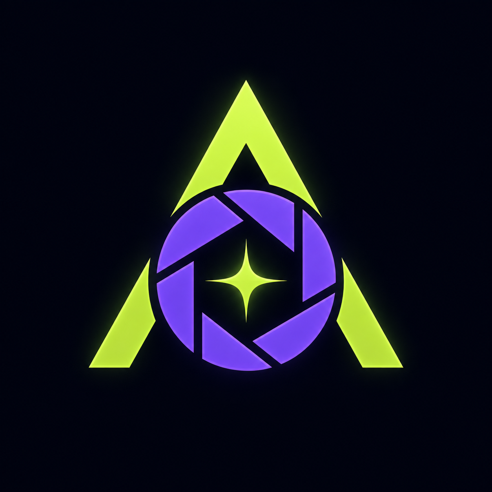

# ADORA AI Studio



เว็บแอปสร้างวิดีโอโฆษณาแนวตั้งแบบครบขั้นตอนบน Google Apps Script โดยใช้ **OpenRouter API key เพียงรายการเดียว** ตั้งแต่วิเคราะห์รูป วาง Creative Plan สร้าง Key Visual จนถึงสร้างวิดีโอ Seedance พร้อมเสียง

- Web App: https://script.google.com/macros/s/AKfycbz0N9eDGVPJRM89kEEfVZxqdGN8e5K1BY1E3LevfV7mCv3jbMdxJsqlx4OpTaNRi8l70g/exec
- GitHub Pages application gateway: https://basssg.github.io/VDO-PROJECT_AFF/

Web App เปิดสิทธิ์แบบ `ANYONE_ANONYMOUS` ผู้ใช้งานจึงเปิดผ่าน GitHub Pages หรือ URL ของ Apps Script ได้โดยไม่ต้องลงชื่อเข้าใช้ Google ระบบทำงานในสิทธิ์ของบัญชีผู้ Deploy (`USER_DEPLOYING`)

> คำเตือน: ผู้ใช้ทุกคนจะใช้เครดิต OpenRouter และพื้นที่ Google Drive ของเจ้าของระบบร่วมกัน ควรกำหนด Budget Limit ที่ OpenRouter และเพิ่มระบบโควตา/Rate limit ก่อนเผยแพร่ให้บุคคลทั่วไปจำนวนมาก

GitHub Pages จะแสดง Google Apps Script Web App ตัวจริงภายในหน้าเดิม จึงยังคง URL `basssg.github.io` ขณะใช้งาน AI หากต้องการเปิดหน้าออกแบบแบบไม่โหลด Application ให้ใช้ `?preview=1` ผู้ใช้ทุกคนเปิดใช้งานได้โดยไม่ต้องเข้าสู่ระบบ Google

## ติดตั้งเป็น Application

GitHub Pages เป็น Progressive Web App (PWA) ติดตั้งได้จากปุ่ม **ติดตั้ง Application** ด้านล่างของหน้าเว็บ:

- Android/Chrome และคอมพิวเตอร์: กดปุ่มติดตั้ง หรือเลือก `Install app` จากเมนู Browser
- iPhone/iPad: เปิดด้วย Safari กด Share แล้วเลือก `Add to Home Screen`

เมื่อติดตั้งแล้ว ADORA จะมีโลโก้และเปิดแบบหน้าต่าง Application โดยยังต้องเชื่อมต่ออินเทอร์เน็ตเพื่อเรียก Apps Script และ OpenRouter

## Workflow

เวอร์ชัน 1.4 เพิ่มโหมดสร้าง Prompt สองแบบ:

- **Prompt Set สำเร็จรูป** — กรอกชื่อสินค้าแล้วเลือกจาก 6 ชุด เช่น ขายไว รีวิวจริง เปิดตัวพรีเมียม Problem/Solution Lifestyle และ Product Demo
- **กำหนด Prompt เอง** — ระบุจุดขาย กลุ่มเป้าหมาย สไตล์ พรีเซนเตอร์ และเขียน Creative Prompt ได้โดยตรง

รูป JPG, PNG และ WEBP ขนาดต้นฉบับสูงสุด 50 MB จะถูกย่อด้านยาวไม่เกิน 2,048 px และบีบอัดใน Browser อัตโนมัติก่อนส่งไป Apps Script โดยไฟล์หลังบีบอัดต้องอยู่ภายในขีดจำกัด 5 MB ของ workflow

1. อัปโหลดรูปสินค้า
2. อัปโหลดรูปพรีเซนเตอร์หรือระบุบุคลิกที่ต้องการ
3. ใส่ชื่อสินค้า จุดขาย กลุ่มเป้าหมาย ข้อเสนอ และข้อห้ามในการโฆษณา
4. เลือกสไตล์ แพลตฟอร์ม ความยาว และแพ็กเกจ AI
5. ระบบใช้ OpenRouter วิเคราะห์งาน สร้างภาพ และสร้างวิดีโอ Seedance เป็น MP4 ไฟล์เดียว
6. ระบบตรวจสอบขนาดและลายเซ็น MP4 ก่อนบันทึก พร้อมให้ดาวน์โหลดทันที และจะแสดงสถานะ `FINALIZING` ระหว่างที่ Google Drive เตรียมตัวเล่น Preview

ความยาวที่รองรับคือ 8, 10, 12 และ 15 วินาที โดยแพ็กเกจประหยัดรองรับสูงสุด 12 วินาที ส่วนแพ็กเกจสมดุลและพรีเมียมรองรับสูงสุด 15 วินาที

## API key ที่ต้องใช้

| Key | จำเป็น | ใช้ทำอะไร | สมัคร/สร้าง Key |
|---|---|---|---|
| `OPENROUTER_API_KEY` | จำเป็น | วิเคราะห์ภาพ วางแผน สร้าง Key Visual และสร้างวิดีโอ Seedance | [OpenRouter Keys](https://openrouter.ai/settings/keys) |

ไม่ต้องใช้ API key ของ Gemini, ByteDance, Seedance หรือ Google Drive แยก เพราะโมเดล AI เรียกผ่าน OpenRouter และ Google Drive ใช้ OAuth ของบัญชีที่ Deploy Apps Script

### ควรใส่ key ที่ไหน

วิธีที่แนะนำคือเปิดเมนู **ตั้งค่าระบบ** ใน Web App ใส่ OpenRouter key แล้วกดบันทึก ระบบจะเก็บ key ใน **Script Properties ฝั่งเซิร์ฟเวอร์** และไม่ส่งค่ากลับไปยัง Browser

อีกวิธีคือใส่ที่ส่วนบนของ `Code.js`:

```javascript
const APP_CONFIG = {
  API_KEYS: {
    OPENROUTER_API_KEY: '',
  },
  // ...
};
```

ห้ามใส่ API key ใน `index.html` หรือ commit key จริงลง GitHub

## แพ็กเกจ AI 3 ระดับ

| แพ็กเกจ | วิเคราะห์ | สร้างภาพ | สร้างวิดีโอ | ความยาวสูงสุด | ประมาณการ 8 วินาที |
|---|---|---|---|---:|---:|
| ประหยัด | `google/gemini-2.5-flash-lite` | `google/gemini-3.1-flash-lite-image` 1K | `bytedance/seedance-1-5-pro` 720p | 12 วินาที | `$0.45–$0.51` |
| สมดุล | `google/gemini-3.6-flash` | `google/gemini-3.1-flash-image` 1K | `bytedance/seedance-2.0-fast` 720p | 15 วินาที | `$1.06–$1.17` |
| พรีเมียม | `anthropic/claude-sonnet-5` | `google/gemini-3-pro-image` 2K | `bytedance/seedance-2.0` 1080p | 15 วินาที | `$3.00–$3.22` |

ราคาเป็น snapshot โดยประมาณสำหรับวิดีโอพร้อมเสียงก่อน retry ณ วันที่พัฒนา ตัวเลขจริงขึ้นกับราคา provider, resolution, usage และค่าธรรมเนียม OpenRouter ควรตรวจราคาใน OpenRouter ก่อนเปิดขายจริง

## โครงสร้างโปรเจกต์

```text
.
├── Code.js          # OpenRouter API, workflow, Drive และ campaign state
├── index.html       # Responsive web application UI
├── appsscript.json  # Apps Script manifest
├── .clasp.json      # เชื่อมกับ Apps Script project
└── README.md
```

`index.html` ใช้ตัว `i` เล็กตามมาตรฐานเว็บ และตรงกับ `createHtmlOutputFromFile('index')` ใน Apps Script

## Deploy ด้วย clasp

โปรเจกต์นี้ใช้ named profile `project-owner` ซึ่งเชื่อมกับบัญชี `bass1135@gmail.com`

```bash
npx --yes @google/clasp@latest -u project-owner show-authorized-user
npx --yes @google/clasp@latest -u project-owner push --force
npx --yes @google/clasp@latest -u project-owner version "ADORA AI Studio release"
npx --yes @google/clasp@latest -u project-owner deployments
```

อัปเดต deployment เดิมด้วย version number ที่สร้างใหม่:

```bash
npx --yes @google/clasp@latest -u project-owner deploy \
  --deploymentId AKfycbz0N9eDGVPJRM89kEEfVZxqdGN8e5K1BY1E3LevfV7mCv3jbMdxJsqlx4OpTaNRi8l70g \
  --versionNumber VERSION \
  --description "ADORA AI Studio OpenRouter-only Seedance release"
```

## ก่อนนำไปขายเป็น SaaS

เวอร์ชันนี้เป็น owner-operated presentation MVP หากจะเปิดให้ลูกค้าหลายคนใช้งาน ควรเพิ่มระบบสมาชิก, tenant isolation, quota/rate limit, billing/usage ledger, moderation, consent, privacy/terms และระบบคิวที่รองรับการใช้งานพร้อมกันจำนวนมาก

รูปและวิดีโอที่ส่งให้ provider ประมวลผลอาจถูกตั้งเป็น anyone-with-link ชั่วคราวตาม workflow ปัจจุบัน ควรทบทวนนโยบายข้อมูลก่อนรับงานที่มีข้อมูลละเอียดอ่อน
