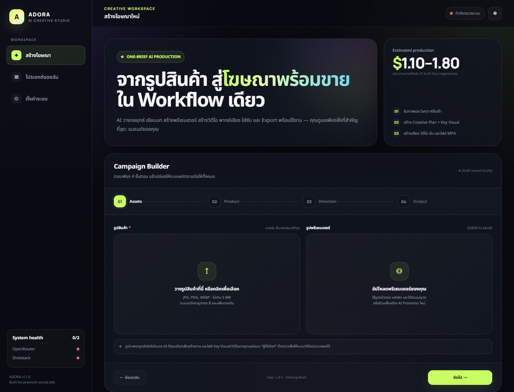
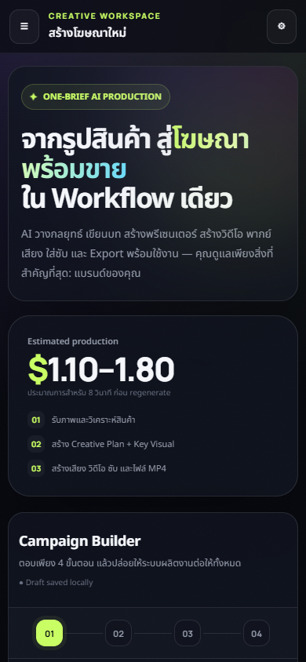

# ADORA AI Studio

เว็บแอปสร้างวิดีโอโฆษณาสินค้าด้วย AI แบบ workflow ตั้งแต่รับรูปสินค้า วางแผนครีเอทีฟ สร้าง key visual สร้างวิดีโอเป็นฉาก และรวมเป็นไฟล์ MP4 พร้อมใช้งาน โดยพัฒนาบน Google Apps Script และ Deploy ด้วย `clasp`

**Web App:** [เปิด ADORA AI Studio](https://script.google.com/macros/s/AKfycbz0N9eDGVPJRM89kEEfVZxqdGN8e5K1BY1E3LevfV7mCv3jbMdxJsqlx4OpTaNRi8l70g/exec)

> Deployment ปัจจุบันตั้งเป็น owner-only (`MYSELF`) เพื่อป้องกันบุคคลอื่นใช้เครดิต API โดยไม่ได้รับอนุญาต เหมาะสำหรับเดโมและนำเสนอภายใต้บัญชีเจ้าของโปรเจกต์



<details>
  <summary>ดูตัวอย่างบนโทรศัพท์</summary>

  
</details>

## จุดเด่น

- Wizard 4 ขั้นตอน: รูปสินค้า → พรีเซนเตอร์ → ข้อมูล/สไตล์ → ตรวจสอบและสร้าง
- AI creative planner, key visual และวิดีโอผ่าน OpenRouter
- รองรับวิดีโอ 8, 16, 24 และ 32 วินาที
- รวมหลายฉาก ใส่ caption และ export MP4 ผ่าน Shotstack
- บันทึกไฟล์และประวัติแคมเปญใน Google Drive
- Responsive สำหรับ desktop, tablet และ mobile พร้อม touch target และ safe area
- API keys เก็บฝั่ง server ใน Apps Script Script Properties ไม่ถูกส่งกลับมาที่ browser
- มี cost estimate ก่อนเริ่มงาน และหน้าติดตามสถานะระหว่างสร้าง

## Workflow

1. อัปโหลดรูปสินค้า และเลือกรูปพรีเซนเตอร์ถ้าต้องการ
2. ระบุชื่อสินค้า จุดขาย กลุ่มเป้าหมาย และคำกระตุ้นการซื้อ
3. เลือกสไตล์ เช่น UGC, Unboxing, Luxury, Lifestyle, Cinematic หรือ Product Focus
4. เลือกความยาว/แพลตฟอร์ม ตรวจค่าใช้จ่ายโดยประมาณ แล้วสั่งสร้าง
5. ระบบวาง storyboard, สร้างภาพ, สร้างวิดีโอแต่ละ scene และรวมไฟล์โดยอัตโนมัติ

## API keys ที่ต้องใช้

| Key | จำเป็นเมื่อไร | ใช้ทำอะไร | แหล่งที่มา |
|---|---|---|---|
| `OPENROUTER_API_KEY` | **จำเป็น** | วางแผนครีเอทีฟ วิเคราะห์ภาพ สร้าง key visual และวิดีโอผ่านโมเดลที่ตั้งค่าไว้ | [OpenRouter Keys](https://openrouter.ai/settings/keys) |
| `SHOTSTACK_API_KEY` | จำเป็นสำหรับงาน 16/24/32 วินาที; ไม่จำเป็นสำหรับวิดีโอฉากเดียว 8 วินาที | รวมหลาย scene, ใส่ caption และ render final MP4 | [Shotstack Dashboard](https://dashboard.shotstack.io/) |

ไม่ต้องใช้ Google Drive API key เพราะ Apps Script ใช้สิทธิ์ OAuth ของบัญชีที่ Deploy ให้อัตโนมัติ และไม่ต้องใช้ Gemini/Veo key แยกเมื่อเรียกโมเดลผ่าน OpenRouter

### ควรใส่ key ที่ไหน

วิธีที่แนะนำคือเปิดเมนู **Settings** ในเว็บแอป กรอก key แล้วกดบันทึก ระบบจะเก็บไว้ใน **Script Properties ฝั่ง server** จากนั้นกด Test connection ได้ทันที

OpenRouter ต้องใช้ **API key สำหรับ inference ปกติ** ไม่ใช่ Management API key เพราะ Management key ใช้จัดการ/หมุนเวียน key เท่านั้นและเรียกโมเดลไม่ได้ ส่วน Shotstack key ต้องเลือก environment ใน Settings ให้ตรงกับชนิด key (`stage` หรือ `v1`)

อีกวิธีคือใส่ค่าที่ส่วนบนของ `Code.js`:

```javascript
const APP_CONFIG = {
  API_KEYS: {
    OPENROUTER_API_KEY: '',
    SHOTSTACK_API_KEY: '',
  },
  // ...
};
```

ห้ามใส่ API key ใน `index.html`, JavaScript ฝั่ง browser หรือ commit key จริงลง GitHub เพราะผู้ใช้สามารถเปิดดู source และนำ key ไปใช้ได้

### Shotstack stage กับ production

- `stage`: sandbox สำหรับทดสอบ วิดีโอมี watermark; AI assets บางประเภทอาจยังมีค่าใช้จ่ายตามเงื่อนไขของผู้ให้บริการ
- `v1`: สำหรับงานจริง ไม่มี watermark และคิดค่า render ตามแพ็กเกจ

## โมเดลเริ่มต้น

- Planner: `google/gemini-3.6-flash`
- Image: `google/gemini-3.1-flash-image`
- Video: `google/veo-3.1-fast`

ชื่อโมเดลแก้ได้จากหน้า Settings หรือ `APP_CONFIG.MODELS` หาก OpenRouter เปลี่ยนชื่อ/ความพร้อมใช้งานของโมเดล

## โครงสร้างโปรเจกต์

```text
.
├── Code.js          # API, workflow, Drive, campaign state และ server functions
├── index.html       # UI, responsive styles และ client workflow
├── appsscript.json  # Apps Script manifest และ web-app permissions
├── .clasp.json      # เชื่อม repository กับ Apps Script project
└── README.md
```

`index.html` ใช้ตัว `i` เล็กตามมาตรฐานเว็บทั่วไปและ GitHub Pages ส่วน Google Apps Script จะทำงานได้เมื่อชื่อใน `createHtmlOutputFromFile('index')` ตรงกับชื่อไฟล์

## Deploy ด้วย clasp

```bash
npm install -g @google/clasp
clasp login
clasp pull
clasp push
clasp version "ADORA AI Studio release"
clasp deployments
```

การอัปเดต deployment เดิม:

```bash
clasp deploy --deploymentId AKfycbz0N9eDGVPJRM89kEEfVZxqdGN8e5K1BY1E3LevfV7mCv3jbMdxJsqlx4OpTaNRi8l70g --versionNumber VERSION
```

## ค่าใช้จ่ายโดยประมาณ

ตัวแอปตั้งค่าประเมินเบื้องต้นที่ประมาณ `$0.10/วินาที` สำหรับวิดีโอ บวกงาน planner/image ประมาณ `$0.30–$1.00` ต่อรอบ ตัวเลขจริงขึ้นกับโมเดล ราคา provider จำนวน retry และค่า render ของ Shotstack ณ เวลาที่ใช้งาน

## ก่อนนำไปขายเป็น SaaS สาธารณะ

เวอร์ชันนี้เป็น owner-operated presentation MVP ที่ใช้งานจริงได้ ภายในบัญชีเจ้าของ หากจะเปิดให้ลูกค้าหลายคนใช้งานและชำระเงินจริง ควรเพิ่มระบบ login, tenant isolation, quota/rate limit, billing, usage ledger, moderation, privacy/terms และกลไกไม่ให้ผู้ใช้ทุกคนใช้ API key กลางโดยไม่มีขีดจำกัด

## หมายเหตุ

- ระบบสร้างไฟล์ MP4 แต่ยังไม่โพสต์เข้า TikTok/Instagram/YouTube โดยตรง จึงยังไม่ต้องใช้ API key ของแพลตฟอร์มเหล่านั้น
- รูปและวิดีโอที่ส่งให้ provider ประมวลผลอาจถูกตั้งเป็น anyone-with-link ชั่วคราวตาม workflow ปัจจุบัน ควรทบทวนนโยบายข้อมูลก่อนรับงานลูกค้าที่มีข้อมูลละเอียดอ่อน
- อย่า commit `.clasprc.json`; ไฟล์นี้มีข้อมูลยืนยันตัวตนของ `clasp` และถูก ignore ไว้แล้ว
